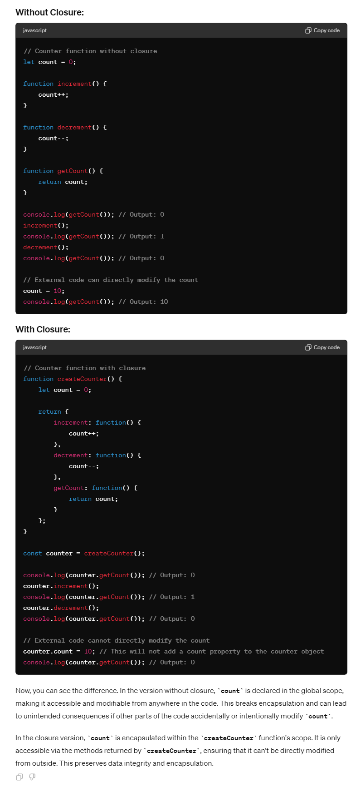
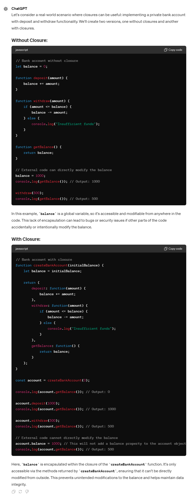
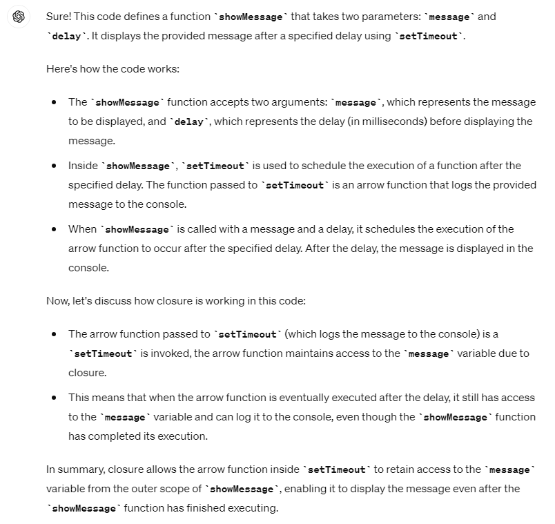
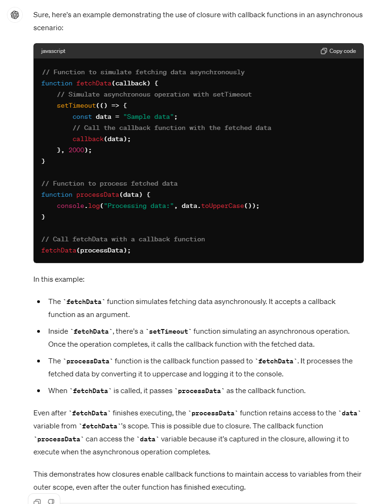
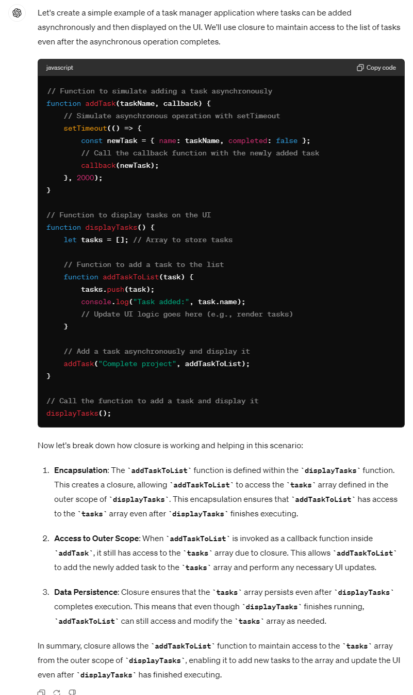

# Execution Context:

In JavaScript, an execution context is the environment where JavaScript code is executed. It contains two components memory component/variable environment and code component/thread of execution.

1. Memory creation phase/variable environment is where the variables and functions are allocated memory even before single line of code is executed.

2. Thread of execution is where the each code of line is executed.

# Global execution context:

The global execution context (GEC) is the top-level context in a JavaScript program and is created when a JavaScript program starts running. It's the default execution context where all JavaScript code that is not inside of a function gets executed. The GEC is the foundation upon which all other execution contexts are built and plays a pivotal role in managing global variables and functions

# CallStack:

Call Stack is a mechanism to keep track of its place in script that calls multiple function.

Javascript manages code execution context creation and deletion with the the help of Call Stack.

Call Stack maintains the order of execution of execution contexts. It is also known as Program Stack, Control Stack, Runtime stack, Machine Stack, Execution context stack.

# undefined:

In first phase (memory allocation) JS assigns each variable a placeholder called undefined. undefined is when memory is allocated for the variable, but no value is assigned yet.

# not defined:

If an object/variable is not even declared/found in memory allocation phase, and tried to access it then it is Not defined

# loosely typed / weakly typed:

Javascript doesn't attach variables to any datatype. We can say var a = 5, and then change the value to boolean a = true or string a = 'hello' later on.

Never assign undefined to a variable manually. Let it happen on it's own accord.

# Hoisting

Hoisting is a javascript mechanism where one can access the variables and functions even before the initislization/assigning value without getting any error.

It can be possible because the variables are assigned as undefined and functions are assigned as function itself during the memory creation phase in the execution context.

so,

Whenever you can console.log var variables before initialisation, it will print as undefined.

Whenever you console.log the functions before initialization, it will print as function itself.

Whenever you call the functions before initialization, it will execute the function because, in the memory creation phase the function is assigned as whole function code itself(not as undefined unlike variables)

# Temporal Dead Zone

Whenever you can console.log let/const variables before intialization, it will print error "Uncaught ReferenceError: Cannot access 'a' before initialization". This is because the let and const declarations only be hoisted and not initialization/assignment. In another fashion, let and const are hoisted without default initialization value "undefined" where the var variables are hoisted with default initialization value "undefined". This keyword "undefined" is a placeholder for memory. It means the var variable is not assigned/not allocated memory to any values, but it is allocated memory using the placeholder "undefined" in place/instead of any values which we assign later on.

The error "Uncaught ReferenceError: Cannot access 'a' before initialization" will remain till our initializations are made to that let/const variable.

The zone between the hoisting of let/const without default value(declarations only) and the initialization of let/const(till assigning value to the let/const) is called temporal dead zone.

> Scenario 1: (console.logging variables before initialization)

> Scenario 2: (console.logging variables without declaration)

> Scenario 3: (console.logging function before even function is written)

> Scenario 4: (calling function even before it is written)

> Scenario 5: (calling function even before it is written where it is assigned to a variable)

> Scenario 6: (calling function even before it is written where it is assigned to a variable)

# let & const in JS, Temporal Dead Zone:

let and const declarations are hoisted. But its different from var

```javascript
console.log(a); // ReferenceError: Cannot access 'a' before initialization
console.log(b); // prints undefined as expected
let a = 10;
console.log(a); // 10
var b = 15;
console.log(window.a); // undefined
console.log(window.b); // 15
```

It looks like let isn't hoisted, but it is, let's understand

- Both a and b are actually initialized as undefined in hoisting stage. But var b is inside the storage space of GLOBAL, and a is in a separate memory object called script, where it can be accessed only after assigning some value to it first ie. one can access 'a' only if it is assigned. Thus, it throws error.

- **Temporal Dead Zone :** Time since when the let variable was hoisted until it is initialized some value.

  - So any line till before "let a = 10" is the TDZ for a

  - Since a is not accessible on global, its not accessible in window/this also. window.b or this.b -> 15; But window.a or this.a ->undefined, just like window.x->undefined (x isn't declared anywhere)

- **Reference Error** are thrown when variables are in temporal dead zone.

- **Syntax Error** doesn't even let us run single line of code.

```javascript
let a = 10;
let a = 100;  //this code is rejected upfront as SyntaxError. (duplicate declaration)
------------------
let a = 10;
var a = 100; // this code also rejected upfront as SyntaxError. (can't use same name in same scope)
```

Let is a stricter version of var. Now, const is even more stricter than let.

```javascript
let a;
a = 10;
console.log(a) // 10. Note declaration and assigning of a is in different lines.
------------------
const b;
b = 10;
console.log(b); // SyntaxError: Missing initializer in const declaration. (This type of declaration won't work with const. const b = 10 only will work)
------------------
const b = 100;
b = 1000; //this gives us TypeError: Assignment to constant variable.
```

# Types of Error: Syntax, Reference, and Type.

**Uncaught ReferenceError: x is not defined at ...**

This Error signifies that x has never been in the scope of the program. This literally means that x was never defined/declared and is being tried to be accesed.

**Uncaught ReferenceError: cannot access 'a' before initialization**

This Error signifies that 'a' cannot be accessed because it is declared as 'let' and since it is not assigned a value, it is its Temporal Dead Zone. Thus, this error occurs.

**Uncaught SyntaxError: Identifier 'a' has already been declared**

This Error signifies that we are redeclaring a variable that is 'let' declared. No execution will take place.

**Uncaught SyntaxError: Missing initializer in const declaration**

This Error signifies that we haven't initialized or assigned value to a const declaration.

**Uncaught TypeError: Assignment to constant variable**

This Error signifies that we are reassigning to a const variable.

**_SOME GOOD PRACTICES:_**

- Try using const wherever possible.
- If not, use let, Avoid var.
- Declare and initialize all variables with let to the top to avoid errors to shrink temporal dead zone window to zero.

# What is scope?

The boundaries/limits within which the variables and functions are accessible is called scope.

Scope in JavaScript refers to the visibility of variables and functions. A variable or function is only accessible within its scope. There are two types of scope in JavaScript: global scope and local scope.

# Global scope:

Variables and functions declared outside of any function are in the global scope. This means that they can be accessed from anywhere in your code.

# Local scope:

Variables and functions declared inside of a function are in the local scope. This means that they can only be accessed from within that function.

# Block scope:

Block scope is the accessibilty of variables and functions inside the block boundaries/limits. Beyond/outside the block the variables cannot be accessed.

Variables and functions declared inside of a block are in the block scope. Block scope is created within specific code blocks, such as conditional statements (if, else, switch) and loops (for, while).

**_Note:_**

# Scenario for [GEC, EC]/When the EC has its outer environment as GEC/when the function has its first outer environment as Global environment:

| In the global level(Global execution context)                                                                                                                                                                       | In the function level(Function execution context)                                                                                                                                                                                                                                                               | In the block level(There is no seperate execution context is created for block, it may present in the global level also, function level also)                                                                                                                                                                                                                                                                      |
| ------------------------------------------------------------------------------------------------------------------------------------------------------------------------------------------------------------------- | --------------------------------------------------------------------------------------------------------------------------------------------------------------------------------------------------------------------------------------------------------------------------------------------------------------- | ------------------------------------------------------------------------------------------------------------------------------------------------------------------------------------------------------------------------------------------------------------------------------------------------------------------------------------------------------------------------------------------------------------------ |
| When the js code starts running, all the variables and functions in the global level(global boundaries/limits)(except the those inside the block) are allocated memory even before single line of code is executed. | Whenever the function is called, function execution context is created, when the function starts executing, all the variables and functions in the function level(function boundaries/limits) in the functions(except those inside the block) are allocated memory even before single line of code is executed. | What is block? Block aka compound statement is used to group JS statements together into 1 group. We group them within {...}. Block scope variables are creacted/evaluated in the "block" in the chrome browser only at the time of execution(at the time of enters the block) and not compiling(variables are declared and memory for these variables are created only when the code execution enters the block.) |
| This is identified as "Global" in chrome browser. All these variables are stored in "Global".                                                                                                                       | This identified as "Local" in chrome browser. All these variables are stored in "Local".                                                                                                                                                                                                                        | This is identified as "Block" in chrome browser. All these variables are stored in "Block".                                                                                                                                                                                                                                                                                                                        |
| var variables present in the global level are attached to "Global" in chrome browser & let, const variables present in the global level are attached to seperate memory space named "script" in chrome browser.     | var, let, const are attached to "Local" in chrome browser.                                                                                                                                                                                                                                                      | var, let, const are attached to "Block" in chrome browser.                                                                                                                                                                                                                                                                                                                                                         |
| "Global" in chrome browser is always present even when no line of code is executed.                                                                                                                                 | "Local" in chrome browser will be created when a function is called and deleted when the code execution is completed.                                                                                                                                                                                           | "Block" in chrome browser will be created when a code execution enters the block and deleted at end of the block.                                                                                                                                                                                                                                                                                                  |
| exical environment for this level is "Global" object only.                                                                                                                                                          | Lexical environment for this level is "Global" object only.                                                                                                                                                                                                                                                     | Not available                                                                                                                                                                                                                                                                                                                                                                                                      |

# Scenario for [GEC, EC, EC, EC..etc]/When the EC has its outer environment as EC/when the function has its first outer environment as function environment/function inside function:

In this scenario only, closure will form.

Whenever the function(inner function) is present inside another function(outer function), variables required for a inner function are present outside of it(that means, present in the outer function environment), those variables are stored in seperate memory called "Closure".

This closure will form only when the variables are needed & it is present in the outer function environment(may first outer function or second outer function and etc..), the closure form only when the variables are required to the current function(inner function) are present in the any of the outer function environment. Otherwise, it will not form.

### Why it is saved in the seperate memory space called closure rather attached to global or script?

This is because, when a function(outer function) returns another function(inner function). Whenever the returned function is called later on, there will not be any outer environment exists for returned function. So, there is no way for this inner function to access the variables which required for its execution after returned from the outer function. So to store the required variables variables even after the the function completes its execution, we need seperate storage/component for remmeber and use it later for execution. So whenever any of the inner function is returned, that returned function will always take the required variables as a part of it and stored in a seperate memory space(Only required variables are stored in any outer function/lexical environment). This seperate storage is identified in chrome browser as "Closure outer function"(Eg. "Closure y"). This "Closure y" is an outer funtion(It means closure is a variable environment of the outer function). Another way of saying is, Closure is a function along with its lexical scope. A function along with reference to its outer environment together forms a closure. Or in other words, A Closure is a combination of a function and its lexical scope bundled together.]

# What is Lexical Environment?

Lexical Environment is equal to local memory + lexical env of its parent. Hence, Lexical Environement is the local memory along with the lexical environment of its parent

Whenever an Execution Context is created, a Lexical environment(LE) is also created and is referenced in the local Execution Context(in memory space).

The any function can be accessible to all of its parents lexical environment.

# What is scope chain?

The process of going one by one to parent and checking for values is called scope chain or Lexcial environment chain.

# What is Lexical Scope/Static scope?

whenever the inner function is store the variables outside the place where that function is being placed physically in the codebase is called Lexical scope. Javascript follows Lexical scope only

# What is Dynamic Scope?

Whenver the inner function is store the variables outside teh place where that function is being called in the codebase is called Dynamic scope.

# What is Shadowing?

```javascript
var a = 100;
{
  var a = 10; // same name as global var
  let b = 20;
  const c = 30;
  console.log(a); // 10
  console.log(b); // 20
  console.log(c); // 30
}
console.log(a); // 10, instead of the 100 we were expecting. So block "a" modified val of global "a" as well. In console, only b and c are in block space. a initially is in global space(a = 100), and when a = 10 line is run, a is not created in block space, but replaces 100 with 10 in global space itself.
```

So, If one has same named variable outside the block, the variable inside the block shadows the outside variable. This happens only for var

Let's observe the behaviour in case of let and const and understand it's reason.

```javascript
let b = 100;
{
  var a = 10;
  let b = 20;
  const c = 30;
  console.log(b); // 20
}
console.log(b); // 100, Both b's are in separate spaces (one in Block(20) and one in Script(another arbitrary mem space)(100)). Same is also true for _const_ declarations.
```

Same logic is true even for functions

```javascript
const c = 100;
function x() {
  const c = 10;
  console.log(c); // 10
}
x();
console.log(c); // 100
```

# What is Illegal Shadowing?

```javascript
let a = 20;
{
  var a = 20;
}
// Uncaught SyntaxError: Identifier 'a' has already been declared
```

We cannot shadow let with var. But it is valid to shadow a let using a let. However, we can shadow var with let.

All scope rules that work in function are same in arrow functions too.

Since var is function scoped, it is not a problem with the code below.

```javascript
let a = 20;
function x() {
  var a = 20;
}
```

# Advantages of Closures:

## Module Design Pattern:

The module design pattern allows us to encapsulate related functionality into a single module or file. It helps organize code, prevent global namespace pollution, and promotes reusability.

### Example 1:

Suppose we're building a web application, and we want to create a module for handling user authentication. We can create a auth.js module that exports functions like login, logout, and getUserInfo.

```javascript
function userAuthentication() {
  let loggedInUser = "no user";

  function login(username, password) {
    //user auth is processing
    loggedInUser = "siva";
  }

  function logout() {
    loggedInUser = null;
  }

  function getUsername() {
    return loggedInUser;
  }

  return {
    login,
    logout,
    getUsername,
  };
}

const authModule = loginAuth();

authModule.login("siva", "secret");

console.log(authModule.getUsername()); // "siva"
```

### Example 2:



### Example 3:


## Data Privacy:



# What is the difference between the Encapsulation and Data Privacy?


## Currying:

Currying is a technique where a function that takes multiple arguments is transformed into a series of functions that take one argument each. It enables partial function application and enhances code flexibility.

Example: Let's create a curried function to calculate the total price of items with tax.

```javascript
const calculateTotalPrice = (taxRate) => (price) =>
  price + price * (taxRate / 100);

const calculateSalesTax = calculateTotalPrice(8); // 8% sales tax
const totalPrice = calculateSalesTax(100); // Price with tax
console.log(totalPrice); // 108
```

### How not utilizing the closure will impact the currying functions?

> ### Answer in image format:

#### Part 1:

- https://github.com/dev-rsiva/Javascript-Machine-Coding-Practice/blob/fc47a00ce7d9019b9531b96cd47dbf0f180f8685/JS%20Concepts/hoisting/image-5.png

- https://github.com/dev-rsiva/Javascript-Machine-Coding-Practice/blob/fc47a00ce7d9019b9531b96cd47dbf0f180f8685/JS%20Concepts/hoisting/image-6.png

#### Part 2:

- https://github.com/dev-rsiva/Javascript-Machine-Coding-Practice/blob/main/JS%20Concepts/hoisting/image-7.png

- https://github.com/dev-rsiva/Javascript-Machine-Coding-Practice/blob/main/JS%20Concepts/hoisting/image-8.png

> ### Answer in pdf format:

#### Part 1:

- https://github.com/dev-rsiva/Javascript-Machine-Coding-Practice/blob/main/JS%20Concepts/hoisting/Closures%20impact%20on%20currying%20(1).pdf

#### Part 2:

- https://github.com/dev-rsiva/Javascript-Machine-Coding-Practice/blob/main/JS%20Concepts/hoisting/Curry%20&%20Partial%20Function.pdf

> ### Answer:

### Answer(part-1):


### Answer(part-2):


## Memoization:

Memoization optimizes expensive function calls by caching their results. It's useful for recursive or repetitive computations.

Example: Implement a memoized Fibonacci function.

```javascript
function fibonacci(n, memo = {}) {
  if (n in memo) return memo[n];
  if (n <= 1) return n;

  memo[n] = fibonacci(n - 1, memo) + fibonacci(n - 2, memo);
  return memo[n];
}

console.log(fibonacci(10)); // 55
```

## Data Hiding and Encapsulation with Class functionality:

Encapsulation hides the internal details of an object and exposes only necessary methods and properties. It improves code maintainability and security.

Example: Create a Person class with private properties.

```javascript
class Person {
  #name; // Private field

  constructor(name) {
    this.#name = name;
  }

  getName() {
    return this.#name;
  }
}

const person = new Person("Alice");
console.log(person.getName()); // 'Alice'
// console.log(person.#name); // Error: Private field '#name' must be declared in an enclosing class
```

## setTimeouts:

setTimeout allows scheduling a function to run after a specified delay. It's commonly used for asynchronous tasks, animations, and event handling.

Example: Delayed message display.

```javascript
function showMessage(message, delay) {
  setTimeout(() => {
    console.log(message);
  }, delay);
}

showMessage("Hello, world!", 2000); // Display after 2 seconds
```



### Another example:



### Real world Scenario:



## Disadvantages of Closure:

- Over consumption of memory
- Memory Leak
- Freeze browser

## setTimeout + Closures Interview Question

    Time, tide and Javascript wait for none.

```javascript
function x() {
  var i = 1;
  setTimeout(function () {
    console.log(i);
  }, 3000);
  console.log("Namaste Javascript");
}
x();
// Output:
// Namaste Javascript
// 1 // after waiting 3 seconds
```

- We expect JS to wait 3 sec, print 1 and then go down and print the string. But JS prints string immediately, waits 3 sec and then prints 1.

- The function inside setTimeout forms a closure (remembers reference to i). So wherever function goes it carries this ref along with it.

- setTimeout takes this callback function & attaches timer of 3000ms and stores it. Goes to next line without waiting and prints string.

- After 3000ms runs out, JS takes function, puts it into call stack and runs it.

- Q: Print 1 after 1 sec, 2 after 2 sec till 5 : Tricky interview question

We assume this has a simple approach as below

```javascript
function x() {
  for (var i = 1; i <= 5; i++) {
    setTimeout(function () {
      console.log(i);
    }, i * 1000);
  }
  console.log("Namaste Javascript");
}
x();
// Output:
// Namaste Javascript
// 6
// 6
// 6
// 6
// 6
```

Reason?

- This happens because of closures. When setTimeout stores the function somewhere and attaches timer to it, the function remembers its reference to i, not value of i. All 5 copies of function point to same reference of i. JS stores these 5 functions, prints string and then comes back to the functions. By then the timer has run fully. And due to looping, the i value became 6. And when the callback fun runs the variable i = 6. So same 6 is printed in each log

- To avoid this, we can use let instead of var as let has Block scope. For each iteration, the i is a new variable altogether(new copy of i). Everytime setTimeout is run, the inside function forms closure with new variable i

- But what if interviewer ask us to implement using var?

```javascript
function x() {
  for (var i = 1; i <= 5; i++) {
    function close(i) {
      setTimeout(function () {
        console.log(i);
      }, i * 1000);
      // put the setT function inside new function close()
    }
    close(i); // everytime you call close(i) it creates new copy of i. Only this time, it is with var itself!
  }
  console.log("Namaste Javascript");
}
x();
```

## Famous Interview Questions ft. Closures

### Q1: What is Closure in Javascript?

Ans: A function along with reference to its outer environment together forms a closure. Or in other words, A Closure is a combination of a function and its lexical scope bundled together. eg:

```javascript
function outer() {
  var a = 10;
  function inner() {
    console.log(a);
  } // inner forms a closure with outer
  return inner;
}
outer()(); // 10 // over here first `()` will return inner function and then using second `()` to call inner function
```

### Q2: Will the below code still forms a closure?

```javascript
function outer() {
  function inner() {
    console.log(a);
  }
  var a = 10;
  return inner;
}
outer()(); // 10
```

Ans: Yes, because inner function forms a closure with its outer environment so sequence doesn't matter.

### Q3: Changing var to let, will it make any difference?

```javascript
function outer() {
  let a = 10;
  function inner() {
    console.log(a);
  }
  return inner;
}
outer()(); // 10
```

Ans: It will still behave the same way.

### Q4: Will inner function have the access to outer function argument?

```javascript
function outer(str) {
  let a = 10;
  function inner() {
    console.log(a, str);
  }
  return inner;
}
outer("Hello There")(); // 10 "Hello There"
```

Ans: Inner function will now form closure and will have access to both a and str.

### Q5: In below code, will inner form closure with outest?

```javascript
function outest() {
  var c = 20;
  function outer(str) {
    let a = 10;
    function inner() {
      console.log(a, c, str);
    }
    return inner;
  }
  return outer;
}
outest()("Hello There")(); // 10 20 "Hello There"
```

Ans: Yes, inner will have access to all its outer environment.

### Q6: Output of below code and explaination?

```javascript
function outest() {
  var c = 20;
  function outer(str) {
    let a = 10;
    function inner() {
      console.log(a, c, str);
    }
    return inner;
  }
  return outer;
}
let a = 100;
outest()("Hello There")(); // 10 20 "Hello There"
```

Ans: Still the same output, the inner function will have reference to inner a, so conflicting name won't matter here. If it wouldn't have find a inside outer function then it would have went more outer to find a and thus have printed 100. So, it try to resolve variable in scope chain and if a wouldn't have been found it would have given reference error.

### Q7: Advantage of Closure?

- Module Design Pattern
- Currying
- Memoize
- Data hiding and encapsulation
- setTimeouts etc.

### Q8: Discuss more on Data hiding and encapsulation?

```javascript
// without closures
var count = 0;
function increment(){
  count++;
}
// in the above code, anyone can access count and change it.

------------------------------------------------------------------

// (with closures) -> put everything into a function
function counter() {
  var count = 0;
  function increment(){
    count++;
  }
}
console.log(count); // this will give referenceError as count can't be accessed. So now we are able to achieve hiding of data

------------------------------------------------------------------

//(increment with function using closure) true function
function counter() {
  var count = 0;
  return function increment(){
    count++;
    console.log(count);
  }
}
var counter1 = counter(); //counter function has closure with count var.
counter1(); // increments counter

var counter2 = counter();
counter2(); // here counter2 is whole new copy of counter function and it wont impack the output of counter1

*************************

// Above code is not good and scalable for say, when you plan to implement decrement counter at a later stage.
// To address this issue, we use *constructors*

// Adding decrement counter and refactoring code:
function Counter() {
//constructor function. Good coding would be to capitalize first letter of constructor function.
  var count = 0;
  this.incrementCounter = function() { //anonymous function
    count++;
    console.log(count);
  }
   this.decrementCounter = function() {
    count--;
    console.log(count);
  }
}

var counter1 = new Counter();  // new keyword for constructor fun
counter1.incrementCounter();
counter1.incrementCounter();
counter1.decrementCounter();
// returns 1 2 1
```

### Q9: Disadvantage of closure?

Ans: Overconsumption of memory when using closure as everytime as those closed over variables are not garbage collected till program expires. So when creating many closures, more memory is accumulated and this can create memory leaks if not handled.

**Garbage collector** : Program in JS engine or browser that frees up unused memory. In highlevel languages like C++ or JAVA, garbage collection is left to the programmer, but in JS engine its done implicitly.

```javascript
function a() {
  var x = 0;
  return function b() {
    console.log(x);
  };
}

var y = a(); // y is a copy of b()
y();

// Once a() is called, its element x should be garbage collected ideally. But fun b has closure over var x. So mem of x cannot be freed. Like this if more closures formed, it becomes an issue. To tacke this, JS engines like v8 and Chrome have smart garbage collection mechanisms. Say we have var x = 0, z = 10 in above code. When console log happens, x is printed as 0 but z is removed automatically.
```

## First Class Functions ft. Anonymous Functions

    Functions are heart ♥ of Javascript.

### Q: What is Function statement?

Below way of creating function are function statement.

```javascript
function a() {
  console.log("Hello");
}
a(); // Hello
```

### Q: What is Function Expression?

Assigning a function to a variable. Function acts like a value.

```javascript
var b = function () {
  console.log("Hello");
};
b();
```

### Q: Difference between function statement and expression

The major difference between these two lies in Hoisting.

```javascript
a(); // "Hello A"
b(); // TypeError
function a() {
  console.log("Hello A");
}
var b = function () {
  console.log("Hello B");
};
// Why? During mem creation phase a is created in memory and function assigned to a. But b is created like a variable (b:undefined) and until code reaches the function()  part, it is still undefined. So it cannot be called.
```

### Q: What is Function Declaration?

Other name for function statement.

### Q: What is Anonymous Function?

A function without a name.

```javascript
function () {

}// this is going to throw Syntax Error - Function Statement requires function name.
```

- They don't have their own identity. So an anonymous function without code inside it results in an error.

- Anonymous functions are used when functions are used as values eg. the code sample for function expression above.

### Q: What is Named Function Expression?

Same as Function Expression but function has a name instead of being anonymous.

```javascript
var b = function xyz() {
  console.log("b called");
};
b(); // "b called"
xyz(); // Throws ReferenceError:xyz is not defined.
// xyz function is not created in global scope. So it can't be called.
```

### Q: Parameters vs Arguments?

```javascript
var b = function (param1, param2) {
  // labels/identifiers are parameters
  console.log("b called");
};
b(arg1, arg2); // arguments - values passed inside function call
```

### Q: What is First Class Function aka First Class Citizens?

We can pass functions inside a function as arguments and /or return a function(HOF). These ability are altogether known as First class function. It is programming concept available in some other languages too.

```javascript
var b = function (param1) {
  console.log(param1); // prints " f() {} "
};
b(function () {});

// Other way of doing the same thing:
var b = function (param1) {
  console.log(param1);
};
function xyz() {}
b(xyz); // same thing as prev code

// we can return a function from a function:
var b = function (param1) {
  return function () {};
};
console.log(b()); //we log the entire fun within b.
```
